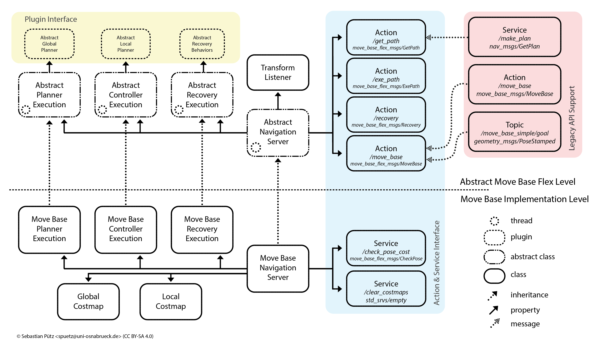

# Move Base Flex; a more flexible navigation framework:

This repository contains Move Base Flex (MBF), a backwards-compatible replacement for move_base. MBF can use existing plugins for move_base, and provides an enhanced version of the same ROS interface. It exposes action servers for planning, controlling and recovering, providing detailed information of the current state and the plugin's feedback. An external executive logic can use MBF and its actions to perform smart and flexible navigation strategies. For example, at [Magazino](https://www.magazino.eu/?lang=en) we have successfully deployed MBF at customer facilities to control TORU robots in highly dynamical environments. Furthermore, MBF enables the use of other map representations, e.g. meshes. The core features are:
 
* Fully backwards-compatible with current ROS navigation.
* Actions for the submodules planning, controlling and recovering, and services to query the costmaps are provided. This interface allows external executives, e.g. SMACH, or Behavior Trees, to run highly flexible and complex navigation strategies.
* Comprehensive result and feedback information on all actions, including error codes and messages from the loaded plugins. For users still relying on a unique navigation interface, we have extended move_base action with detailed result and feedback information (though we still provide the current one).
* Separation between an abstract navigation framework and concrete implementations, allowing faster development of new applications, e.g. 3D navigation.

## Installation
Required dependencies ROS Kinetic, navigation.

#### ROS

[See install instructions here.](http://wiki.ros.org/kinetic/Installation)

#### Navigation

`sudo apt-get install ros-kinetic-navigation`

## Concepts & Architecture

We have created Move Base Flex for a larger target group besides the standard developers and users of move_base and 2D navigation based on costmaps, as well as addressed move_base's limitations. Since robot navigation can be separated into planning and controlling in many cases, even for outdoor scenarios without the benefits of flat terrain, we designed MBF based on abstract planner-, controller- and recovery behavior-execution classes. To accomplish this goal, we created abstract base classes for the nav core BaseLocalPlanner, BaseGlobalPlanner and RecoveryBehavior plugin interfaces, extending the API to provide a richer and more expressive interface without breaking the current move_base plugin API. The new abstract interfaces allow plugins to return valuable information in each execution cycle, e.g. why a valid plan or a velocity command could not be computed. This information is then passed to the external executive logic through MBF planning, navigation or recovering actions’ feedback and result. The planner, controller and recovery behavior execution is implemented in the abstract execution classes without binding the software implementation to 2D costmaps. In our framework, MoveBase is just a particular implementation of a navigation system: its execution classes implement the abstract ones, bind the system to the costmaps. Thereby, the system can easily be used for other approaches, e.g. navigation on meshes or 3D occupancy grid maps. However, we provide a SimpleNavigationServer class without a binding to costmaps.

MBF architecture:

## Future Work
MBF is an ongoing project; some of the improvements we we have planned for the near future are:

* Replace costmap_2d by grid_map in the MoveBase implementation.
* Allow multiple planners and controllers, selectable at runtime
* Add pause/resume interface for the controller, for example to recover from a bumper, or an emergency stop button hit

But of course your are welcome to propose new fancy features and help make them a reality! Some possibilites:

* Concurrently running recovery behaviors
* Constraints-based goal (see issue #8)
